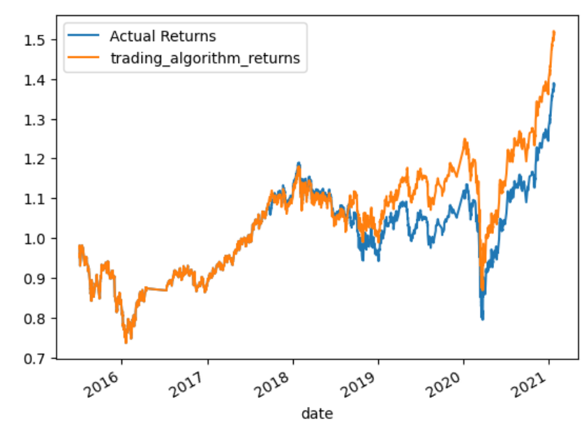
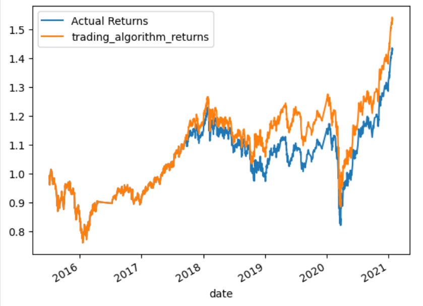

# Machine_Learning_Trading_bot

Objective:  To create an algorithmic trading toll using Python programming,  The algorithmic trading bot  learns and adapts to new data as we modify some of the variables to adjust a base model.

The Jupyter Notebook with the file is located under the Starter Code Folder and named: machine_learning_trading_bot.ipynb

##Base Model:

For the base model we are using a 3 month trainning period and a short :4 long: 100 variables for the data we use. 

image[

As we can see in the graph above, the base model predicts higher returns than the actual retuns so there. Precision is at 43 and 56 for the -1 (sell) and 1(buy) trading signals respectively adn the accuracy is at 55% which is not very high.

## Step 1: Tune the training algorithm by adjusting the size of the training dataset.
To do so, slice your data into different periods. Rerun the notebook with the updated parameters, and record the results in your README.md file.

Answer the following question: What impact resulted from increasing or decreasing the training window? I decresed the trainning perios to 2 months and the and then increased it to 7. The results show that a shorter trainning period predicts actual returns closer as seen in these graphs: 

image[

Decreasing the trainning period to 2 months appears to impove some of the predictions after 2020 where both actual and predicted retuns are very close. However, for predictions before 2020 the predicted returns are over the actual retunrs.

image[

Increasing the trainning period to 7 months has a opposite effect where the earlier predictions show actual returns higher than the predicted ones and, after 2020, lower actual returns than the ones predicted.

## Step 2: Tune the trading algorithm by adjusting the SMA input features. What impact resulted from increasing or decreasing either or both of the SMA windows?

SMA1
short_window = 7
long_window = 90
image[

This model makes both Actual and Predicted return curves very close with Actual returns higher by a small margin.  Both curves appear to follow the same trends.  This model appears to perform better than the base model.

SMA2
short_window = 2
long_window = 110
image[

This model makes both actual and predicted trends appear in synch but there is a consisten overstating of the predicted returns for the majority of the period. However, it appears the predicted returns are better than the base model.

## Step 3 Logistic regression Model

The Logictic regression model does not perform better than either the base or modified models. It underpredicts earlier returns and overpredicts them for the majority of the timeseries I evaluated.

#### Resources
Berkeley Fintech Bootcamp Class Materials
ASKBCS LEarning 3/28/24
